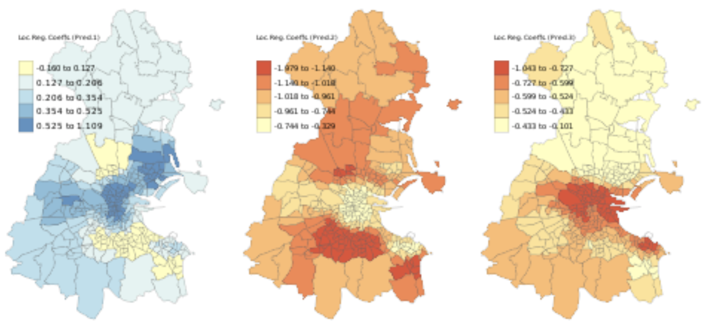

# ‘GWR.multicollin.diagno’: a Function to Address Multicollinearity in Geographically Weighted Regression Models

### Introduction and rationale

Geographically weighted models are designed to handle non-stationary spatial data, whose properties vary across the study area. Geographically weighted regression explores spatially- varying relationships between dependent and independent variables, and aims at finding spatial heterogeneities is these relationships. It uses a kernel function to calculate weights applied in a series of local linear regression models across the study area. A common form of data visualization that follows is a map of local GWR coefficients associated with each explanatory variable.

The function presented in this paper addresses a limitation of geographically weighted regression, multicollinearity. Collinearity between independent variables, even moderate, can lead to strong dependence in local estimated coefficients which, in turn, can weaken or even invalidate interpretation of local coefficients. Multicollinearity can be identified at two levels. On the one hand, codependent predictor variables cause correlations between overall sets of local coefficients. On the other hand, pairs of local regression coefficients can be correlated at one specific location. When controlling GWR, it is crucial to assess multicollinearity at both levels; indeed, local coefficients may be collinear even in the absence of significant global correlation between the independent variables underlying the GWR model (Wheeler & Tiefelsdorf, 2005, 163).

### Brief description of the analysis implemented

After mapping the local coefficients estimated by a basic geographically weighted regression, the function introduced in this model conducts a diagnosis of multicollinearity, on both global and local levels. It uses basic correlation tests to exhibit multicollinearity between explanatory variables and among regression coefficients associated to them on a global level, and maps other statistical explanatory tools (variance inflation factors, local correlations, local condition numbers) to uncover potential multicollinearity at specific locations. The Condition Number and Variance Inflation Factor (VIF) are the two most commonly used measures to detect multicollinearity. The latter is the ratio of the overall model variance over the variance of a model that only includes the independent variable of interest.

### A Note on ‘GWmodel’

The package ‘GWmodel’ (Gollini et al., 2015) is an essential element of the function presented in this paper. It builds on both ‘gwrr’ and ‘spgwr’ packages to provide a wide range of geographically weighted modelling tools. For consistency in the function, it is used to model both the geographically weighted regression and the subsequent diagnosis of multicollinearity. ‘GWmodel’ could even be used in potential follow-ups from this function; for example, it includes ‘gwr.lcr()’, which is a GWR with a locally-compensated ridge term to address local collinearity issues.

### More on ‘GWR.multicollin.diagno’

#### Parameters

#### Packages required (to be loaded beforehand)

## Worked example of the function in action

### Data set & preparations

The function will be tested on one of the example data sets associated with the ‘GWmodel’ package: data (DubVoter) loads it. “DubVoter” is a SpatialPolygonsDataFrame composed of nine percentage variables that measure voter turnout in the 2004 election and eight characteristics of social structure across 322 Electoral Divisions of Greater Dublin.

We set the coordinate system to the British National Grid:
proj4string (Dub.voter) <- CRS("+init=epsg:27700")
We demonstrate the function with:
- ‘Dependent’ = voter turnout (‘GenEl2004’)
- ‘Predictor1’ = social class one (high social class) (‘SC1’)
- ‘Predictor2’ = unemployed (‘Unempl’)
- ‘Predictor3’ = one-year migrants (i.e., moved to a different address one year ago) (‘DiffAdd’) - ‘Kernel’ = “gaussian”
- ‘Bandwidth’ = not specified (calculated by bw.gwr ())

### Demonstration of the function

GWR.multicollin.diagno(Dub.voter,Dub.voter$GenEl2004, Dub.voter$SC1, Dub.voter$Unempl, Dub.voter$DiffAdd)

#### First overview (global linear regression analysis)

First, a global linear regression analysis is run to give a sense of the relationship between the chosen dependent and independent variables.

While the correlation between the percentage of unemployed people and voter turnout is twice stronger than the correlation between and the percentage of one-year migrants and voter turnout, both independent variables display a statistically significant negative relationship with voter turnout. On the other hand, the percentage of people from a high social class is positively correlated with voter turnout. However, ‘SC1’ seems to be a weaker predictor of voter turnout than ‘Unempl’ and ‘DiffAdd’ as its p-value is much bigger.

#### Geographically Weighted Regression (custom kernel & bandwidth)

*Fig. 1 - GWR visualization: maps of local regression coefficients*

As expected, the high social class variable displays an overall positive relationship with voter turnout. However, this correlation fades and even becomes negative in certain areas. This counterintuitive observation, associated with the relatively high p-value, confirms the weakness of the high social class variable in this model.

Both other explanatory variables are negatively correlated to voter turnout. The relationships are not homogeneous across Greater Dublin with those at the center of the subject area more impacted by the percentage of one-year migrants, while areas to the south and north exhibit a stronger impact of unemployment on voter turnout.

*Fig. 2 - Overall fit of the model*

The R-squared values mapped above indicate some heterogeneity in the fit of the model across Greater Dublin. The relationship between variables seems to be stronger at the center and south-east of the study area, where local R-squared are higher.

#### Diagnose global multicollinearity on a global level

The function includes different methods to identify global multicollinearity. It prints the correlation coefficients between the variables themselves, and between their associated local regression coefficients estimated by GWR.

---

Correlation coefficient between Pred.1 & Pred.2: -0.59
P-value: 8.8e-32

Correlation coefficient between Pred.1 & Pred.3: 0.37
P-value: 5.0e-12

Correlation coefficient between Pred.2 & Pred.3: 0.01
P-value: 0.92

*Fig. 3 - Correlation between local regression coefficients*

--- 

There is a clear positive correlation between the percentage of people from a high social class and the percentage of one-year migrants, and negative relationship between high social class and unemployment. However, no statistically significant correlation can be observed between the percentage of one-year migrants and unemployment.

Moreover, the statistically significant correlations between local regression coefficients in the GWR model is a sign of multicollinearity.

Global Variance Inflation Factors:

| SC1  | Unempl | DiffAdd |
|------|--------|---------|
| 1.96 | 1.69   | 1.28    |

The rule of thumb is that VIFs of 10 or above indicate excessive collinearity (Salmerón, 2018, 2366). Here, global VIFs do not display such alarming levels of multicollinearity. It is nevertheless crucial to keep in mind that these values should always be examined in context.

The one-year migrants variable seems to be the least affected by multicollinearity.

#### Address local multicollinearity on a local level

Once global multicollinearity has been assessed, the function allows to carry on with the identification of multicollinearity on a local level.

*Fig. 4 - Local correlation maps*

The map on the right-hand side displays both positive and negative correlations between the unemployment and the percentage of one-year migrants. This counter-intuitive result is a result of the lack of statistically significant correlation between the two independent variables mentioned above.

The other two maps exhibit heterogeneous levels of correlation between the percentage of people from a high social class and unemployment (left-hand side), or the percentage of one- year migrants (middle). These uneven correlations might cause heterogeneity in the strength of multicollinearity studied later.

*Fig. 5 - Local variance inflation factors (VIFs) for each predictor*

Mapping local variance inflation factors allows to measure multicollinearity across the study area. It expands on the results of the calculation of global VIFs by exhibiting heterogeneities. Then, the user of the function can investigate the reasons behind those differences in the strength of multicollinearity and can make informed choices for potential follow-ups.

*Fig. 6 - Local Condition Number Map*

The condition number is another measure of multicollinearity in linear regression models. Usually, when between 10 and 30, it indicates presence of multicollinearity; when its value is bigger than 30, the latter is deemed as strong. Mapping local condition numbers exhibits the extent and the heterogeneity of multicollinearity in the geographically weighted regression model processed by the function. In this example, it is most pronounced at the south-east of Greater Dublin.

## Conclusion

Geographically weighted regression is a popular procedure used across a wide range of disciplines. It is therefore crucial to limit the effects of one of its main jeopardizer, multicollinearity. Wheeler (2005) advocates for caution when interpreting spatial patterns of local GWR coefficients; diagnostics tests, like those included in the function presented in this paper, should be used to control GWR, on both local and global levels, to limit weak or invalid interpretations due to multicollinearity.

### Potential further applications

Wheeler (2005) argues that the effects of the choice of bandwidth and kernel function on multicollinearity requires further research. Therefore, both parameters are made optional in the function to allow for adjustments and observations.
 
If the function uncovers multicollinearity, the user has multiple choices available. They can either keep the GWR unchanged and use the outcome of the function do make an informed interpretation, remove or transform predictors of the model if they clearly creates global and local multicollinearity issues, or choose to use a different non-stationary regression model like the GW ridge regression model and the GW lasso (Wheeler, 2009).

### Limitations

This function, and the geographically weighted models it includes, suffer from the limitations underlying all linear regression analyses. The interpretation of GWR and its diagnosis can be harmed by non-linearity between dependent and independent variables and outliers for example. Moreover, the analysis can only include three explanatory variables, which is a limiting factor in the regression models here. Finally, running the function requires a fair amount of data preparation and loading of packages.

--- 

## Flow Diagram

--- 

## Bibliography

Gollini, I., Lu, B., Charlton, M., Brunsdon, C., & Harris, P. (2015). GWmodel: An R Package for Exploring Spatial Heterogeneity Using Geographically Weighted Models. Journal of Statistical Software, 63(17), 1–50

Salmerón, R., García C. B. & García J. (2018) Variance Inflation Factor and Condition Number in multiple linear regression, Journal of Statistical Computation and Simulation, 88 (12), 2365-2384

Wheeler, D., & Tiefelsdorf, M. (2005). Multicollinearity and correlation among local regression coefficients in geographically weighted regression. Journal of Geographical Systems, 7(2), 161-187.

Wheeler, D. C. (2007). Diagnostic tools and a remedial method for collinearity in geographically weighted regression. Environment and Planning A, 39(10), 2464-2481

Wheeler, D. C. (2009). Simultaneous coefficient penalization and model selection in geographically weighted regression: the geographically weighted lasso. Environment and Planning A, 41(3), 722-742.